# Gossip Room

**Gossip Room** – Messaging App  
## **Live demo** [gossip-room.surge.sh](http://gossip-room.surge.sh/)

## Technologies

- React
- TypeScript
- Redux
- Redux-Saga
- GraphQL query
- AJAX
- Socket.IO

## Usage

### Registration
For registration fill in fields:
* Login
* Nick
* Password
* Password check

Password and Password check must match in another case user will see the message «Passwords does not match».

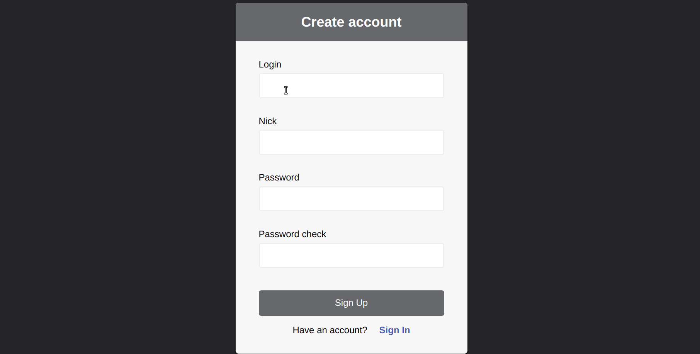

### Log in
For log in fill in fields:
* Login
* Password

If login or password was incorrect, user will see the message «Wrong login or password».

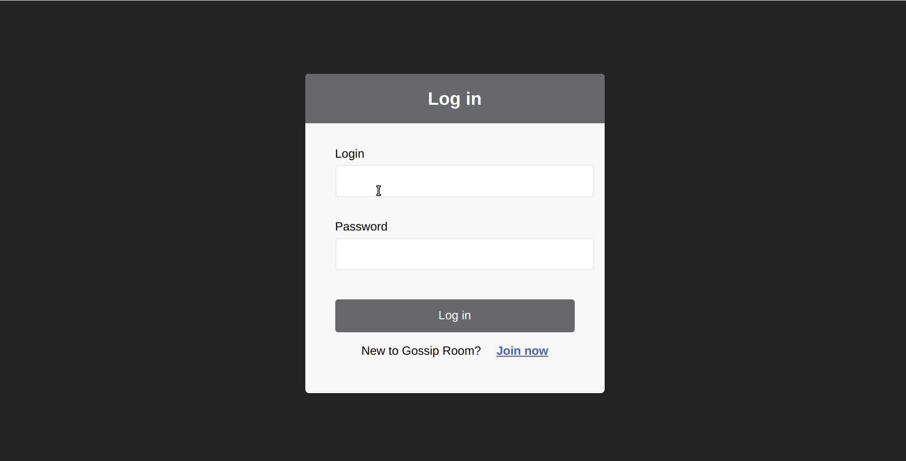

### Profile
The Profile tab is displayed after registration or login.

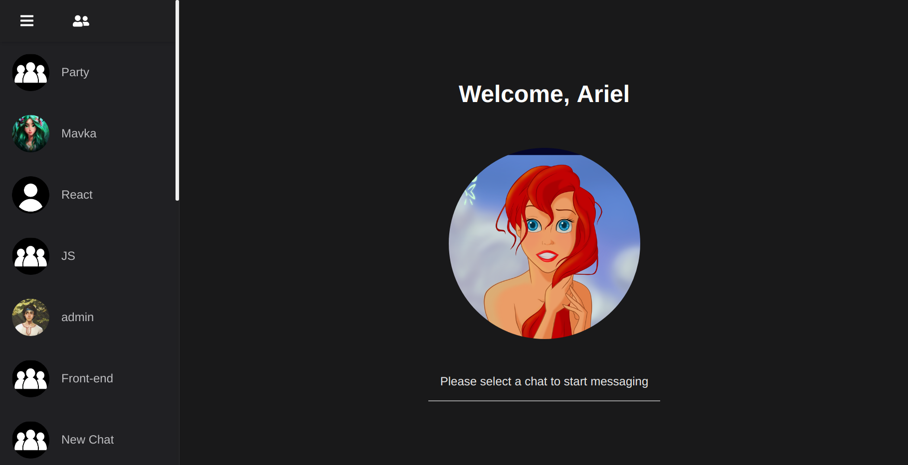 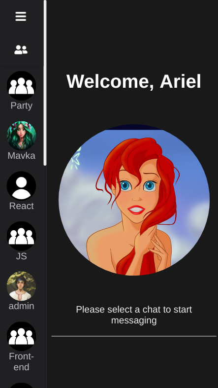

A greeting is displayed on the main part of the tab before choosing an active chat.

A sidebar has two states: a list of contacts or a list of user chats.

After click on a contact the main part of the tab displays a chat with the message history or a new chat will be created.

### User menu
User menu includes following options:
* New group
* User Settings
* Exit

  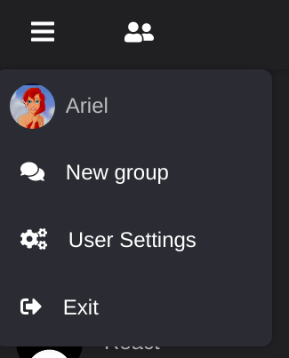

#### User settings
User settings дает пользователю возможность установить: 
* Avatar
* Login
* Nick
* Password

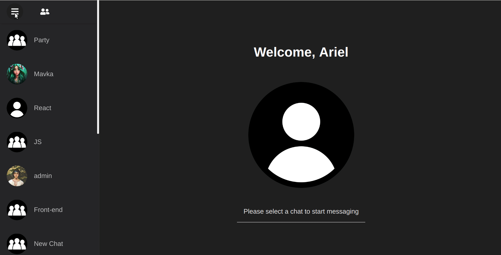

#### New group
A Create New Chat tab allows to create a chat group of users. For creating such a chat user needs to set a chat name and select users from the contact list.

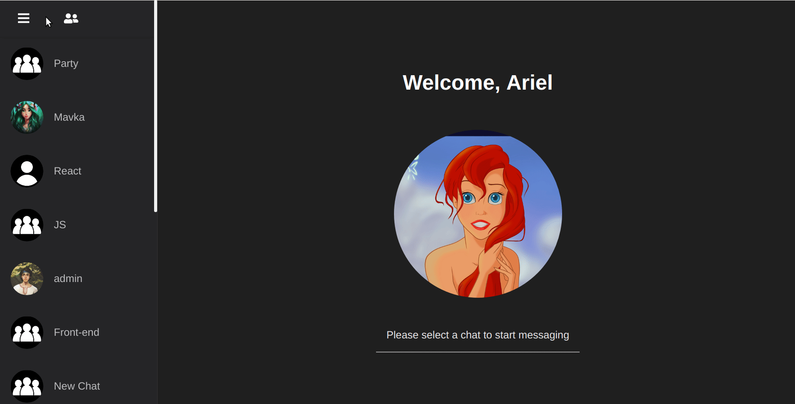

### Messaging
In addition to simple text messages a chat functionality also allows to send and receive emoji, images, video, audio and any other types of files.

User can see image, video, YouTube link preview and listen to audio directly in the chat.

Messages with links are displayed as a block with a link to a resource, description and poster.

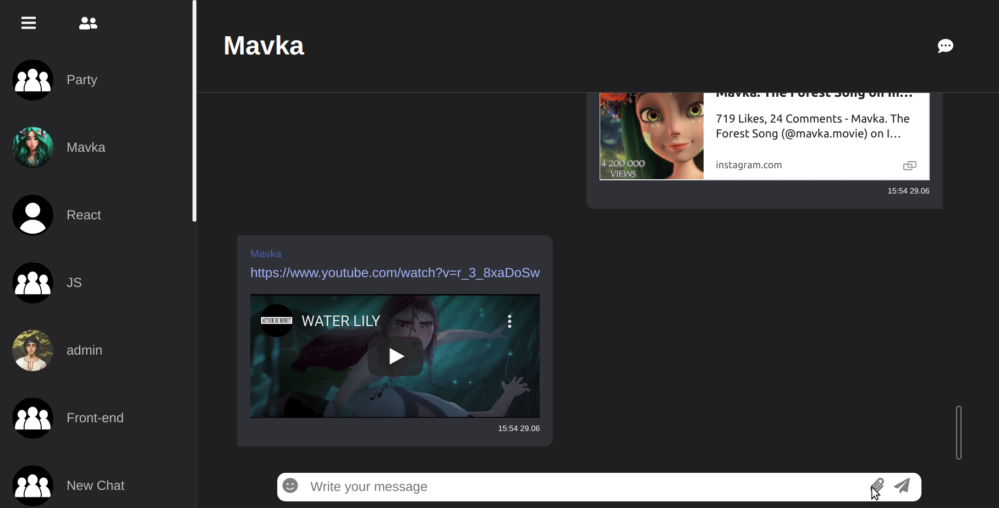

Also implemented Reply and  Forward Message functionality.

Messages are displayed in real time.

When user receives or sends new messages, the chat window automatically scrolls down.

A sound signal informs about a new message.

Also was  implemented an unread message counter, which is displayed next to the name of a chat in the sidebar.

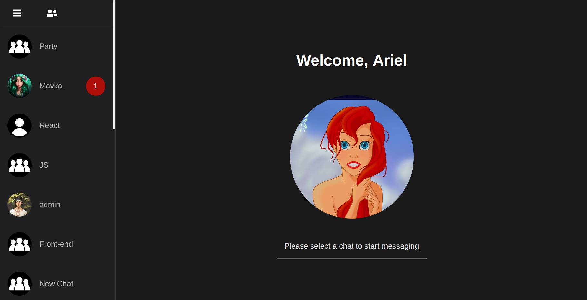 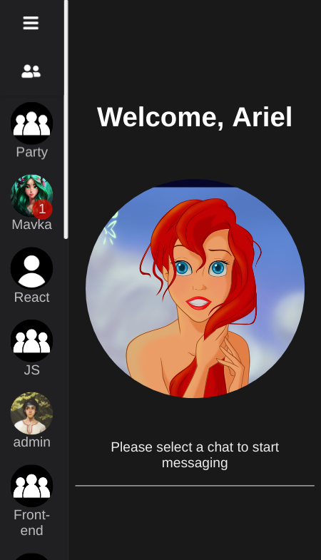

### Chat settings
Chat has menu with next option:
* Chat Settings

  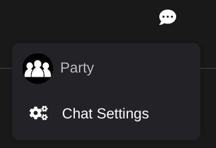

A name of a chat can be set in the “Chat Settings” tab.

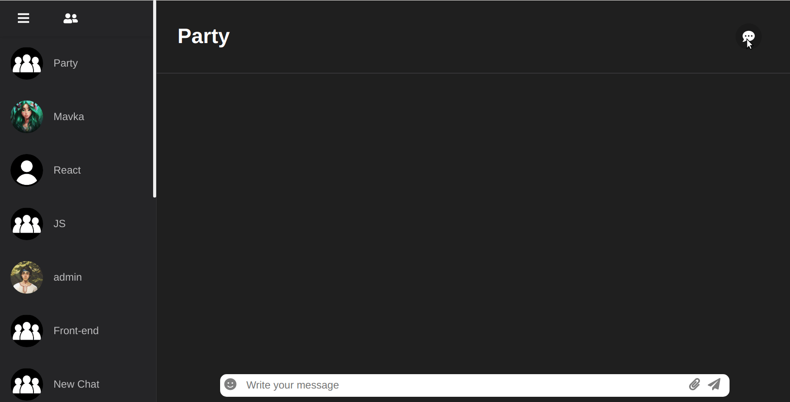

## Install

1.	Clone the repo `git clone git@github.com:LilyUdovyk/GossipRoom.git`
2.	Change directory `cd GossipRoom`
3.	Install dependencies `npm install` or `yarn install`
4.	Run the application `npm start` or `yarn start`

## Deploy

For deploy was chosen Surge, but you can choose any other resource.

1. Getting Surge `npm install -g surge` or `yarn global add  surge`
2. Add a new value to *package.json* at the top level `"homepage": "./"`
3. In *package.json* in the *scripts* section, replace the value *build* `"build": "react-scripts build && cp build/index.html build/404.html"`
4. Preparing to deploy `npm run build` or `yarn build`
5. Change directory `cd build`
6. Deploying `surge`
7. Hit **enter** in your project directory to get it online immediately
8. Setting the hostname *NAME.surge.sh*

